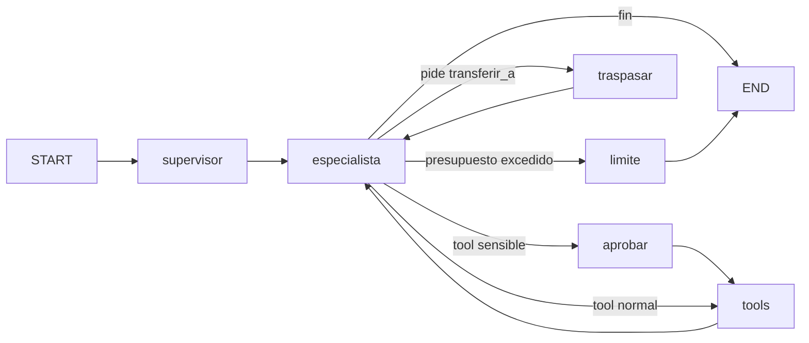

# Tour de arquitectura — agent_harness

Explicación didáctica de por qué `agent_harness` está armado como está. Para la referencia técnica
rápida (mapa de archivos, decisiones en una línea), ver [`README.md`](README.md). Esto es el "por qué"
detrás de esa referencia.

## El problema y la idea central

Un LLM que solo responde texto es fácil de construir. El problema aparece cuando ese agente puede
**ejecutar acciones reales** (cancelar un pedido, cambiar una dirección, cobrar algo). Ahí necesitás
que el agente sea seguro, barato y observable — no solo elocuente. Toda la arquitectura de
`agent_harness` es la respuesta a esa necesidad.

La idea central se resume en una frase, citada tal cual del `README.md` de la plantilla:

> **El modelo propone, el código dispone.**

El LLM nunca ejecuta nada directamente. Solo puede *pedir* una tool (`tool_use`). Quien decide si esa
tool se corre, con qué validaciones, si necesita aprobación humana, y qué se le devuelve, es código
Python determinista (`harness/runner.py`). Así, si el modelo alucina o un prompt injection intenta
manipularlo, no hay ruta directa a una acción real: siempre hay una puerta de código en el medio.

## Recorrido por capas

| Archivo / carpeta | Qué hace |
| --- | --- |
| `config.py` | Ajustes inmutables desde el entorno (`.env`), estilo 12-factor |
| `llm.py` | Único lugar que importa `anthropic`. Todo lo demás habla con un `Protocol LLM`, sustituible por un doble de prueba |
| `state.py` | Qué campos del estado se acumulan (`historial`) vs se reinician cada turno (`aprobado`, `traspasos`) |
| `graph.py` | El orquestador (LangGraph): supervisor + especialista(s) + reglas de decisión |
| `tools/` | Una `Tool` = función + schema + política (¿es sensible? ¿idempotente?) |
| `agents/` | Un `AgentSpec` = nombre + prompt + qué tools puede usar |
| `harness/` | Las reglas de seguridad, como **código**, no como prompts |
| `memory/` | Memoria de hilo (conversación) y memoria de usuario (largo plazo) |
| `evals/` | Casos de prueba que son la red de seguridad antes de tocar prompts |

El flujo del grafo, tal como está documentado en `graph.py`:

El **supervisor** decide qué especialista atiende (con un solo agente, ni siquiera llama al LLM: cero
costo extra). El **especialista** responde o pide tools. Ahí es donde entra el harness: `aprobar`,
`tools`, `traspasar` y `limite` son los nodos que aplican las reglas de seguridad antes de que algo se
ejecute de verdad.

## Decisiones clave (y por qué)

1. **Guardrails = código, no prompts.** `harness/guardrails.py` decide presupuesto, traspasos y qué
   necesita aprobación. Un prompt se puede ignorar o manipular; una función Python, no.
2. **Fail closed.** Sin aprobador → se rechaza. Una aprobación solo vale para ese turno (`aprobado` se
   resetea siempre). El default ante cualquier falla es "no ejecutar", nunca "ejecutar por si acaso".
3. **Cada `tool_use` recibe su `tool_result`, siempre.** Si el modelo pide una tool y el historial no
   la contesta (se rechazó, se cortó por presupuesto, hubo un traspaso), la API de Anthropic tira error
   400 en el siguiente turno. Por eso `traspasar()` y `limite()` responden explícitamente cada
   `tool_use` pendiente, aunque sea con "no ejecutada".
4. **Orden fijo en `decidir()`: presupuesto → traspaso → aprobación → tools.** `limite` va primero
   porque es el único nodo que cierra *todos* los `tool_use` pendientes de una. Si el traspaso se
   evaluara antes, podría colarse después de agotado el presupuesto.
5. **Degradar, no caerse.** Si la API falla, el supervisor sigue con el agente anterior y el
   especialista devuelve un texto de falla, pero con el historial bien cerrado para no romper el
   próximo turno.
6. **Resultados de tools = datos no confiables.** Van envueltos en `<resultado_tool>`
   (`harness/safety.py`) y se sanitizan. La defensa real contra una tool manipulada no es la
   sanitización (es una mitigación) — es que las acciones sensibles pasan por aprobación humana.
7. **Empezar simple, crecer sin reescribir.** Con un solo `AgentSpec` no hay ni llamada a supervisor ni
   tool `transferir_a`. Agregar un segundo agente no toca `graph.py`: se agrega un `AgentSpec` a la
   lista en `app.py` y el supervisor y los traspasos aparecen solos.

Lo que **no** está (API REST, colas, sandbox de código, memoria vectorial) es intencional: son capas
que se agregan encima, no parte del núcleo.
